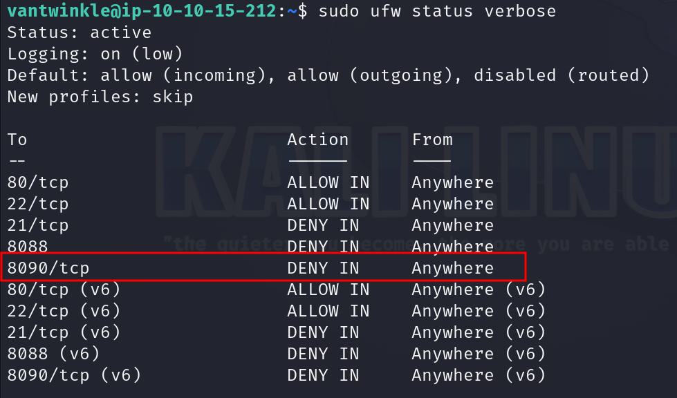
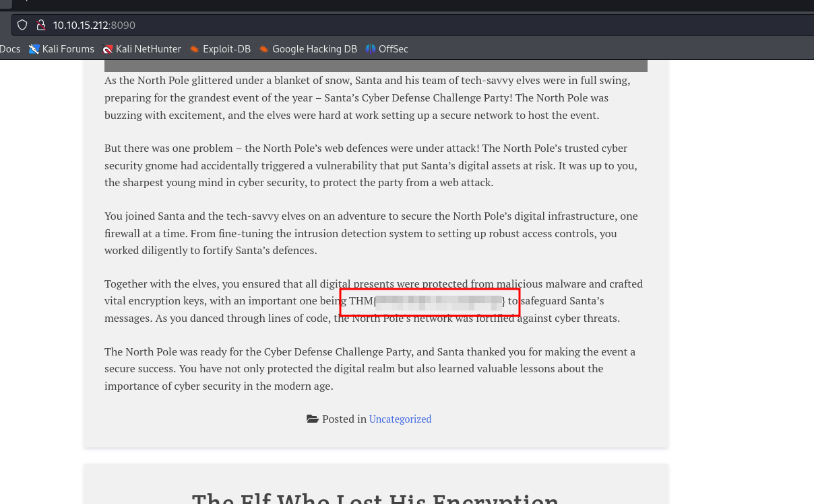

#  To the Pots, Through the Walls

## Solution
- Hit "Start Machine" and open the Split Screen View or connect through SSH.
- What is the default port for Jenkins?
```bash
sudo nmap -T4 10.10.99.188 
```
- Which security model is being used to analyse the breach and defence strategies?
The model is described in the task introduction.
- Which defence capability is used to actively search for signs of malicious activity?
The capability is described in the task introduction.
- What are our main two infrastructure focuses? (Answer format: answer1 and answer2)
Both are described in the task introduction.
- Which firewall command is used to block traffic?
The firewall command is in the task introduction.
- There is a flag in one of the stories. Can you find it?
<br/>
Run the rules script.

```bash
sudo ./home/vantwinkle/Van_Twinkle_rules.sh
```
List the firewall rules.
```bash
sudo ufw status verbose
```



Notice the incoming traffic on port 8090/tcp is blocked. Allow the incoming traffic.
```bash
sudo ufw allow 8090/tcp
```
The website is accessible now. Browse http://IP:8090. Scrolling the website the flag can be retrieved.


