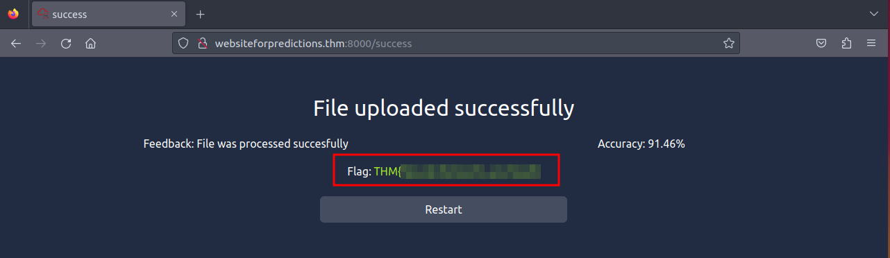

#  The Little Machine That Wanted To Learn

## Solution
- Hit "Start Machine" and open the Split Screen View.
- What is the other term given for Artificial Intelligence or the subset of AI meant to teach computers how humans think or nature works? 
<br/>
It is written in the description.
- What ML structure aims to mimic the process of natural selection and evolution?
<br/>
It is written in the description.
- What is the name of the learning style that makes use of labelled data to train an ML structure?
<br/>
It is written in the description.
- What is the name of the layer between the Input and Output layers of a Neural Network?
<br/>
It is written in the description.
- What is the name of the process used to provide feedback to the Neural Network on how close its prediction was?
<br/>
It is written in the description.
- What is the value of the flag you received after achieving more than 90% accuracy on your submitted predictions?
<br/>
Update the detector.py file following the code. Train the network until the accuracy is more than 90%.
```bash
python3 detector.py
```


Then, upload the predictions to http://websiteforpredictions.thm:8000/ to get the flag.


