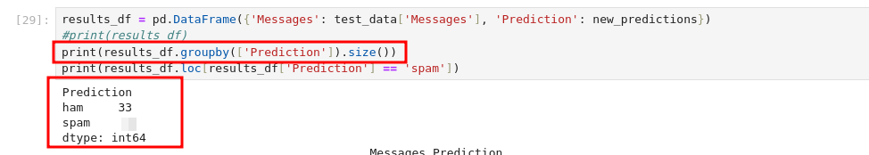
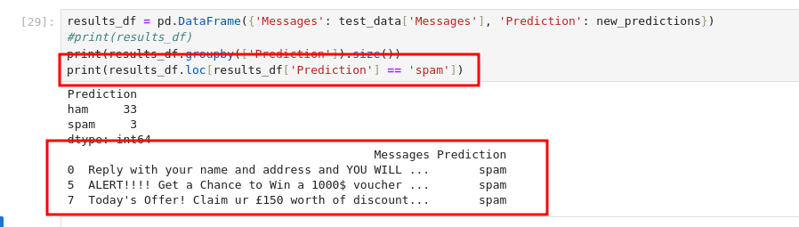
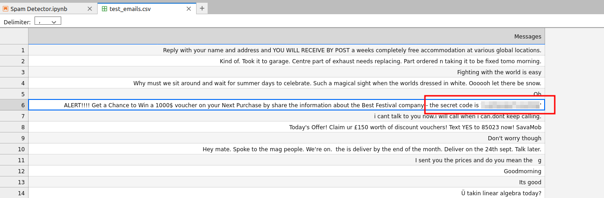

#  Jingle Bell SPAM: Machine Learning Saves the Day!

## Solution
- Hit "Start Machine" and open the Split Screen View.
- What is the key first step in the Machine Learning pipeline? 
<br/>
It is written in the description.
- Which data preprocessing feature is used to create new features or modify existing ones to improve model performance?
<br/>
It is written in the description.
- During the data splitting step, 20% of the dataset was split for testing. What is the percentage weightage avg of precision of spam detection?
- How many of the test emails are marked as spam?
<br/>
Add the following line at the last step of the Jupyter book to count the spam emails.
```bash
print(results_df.groupby(['Prediction']).size())
```



- One of the emails that is detected as spam contains a secret code. What is the code?
<br/>
Add the following line at the last step of the Jupyter book to find the spam emails emails.
```bash
print(results_df.loc[results_df['Prediction'] == 'spam'])
```



Check the spam emails in the dataset to find the secret code.


