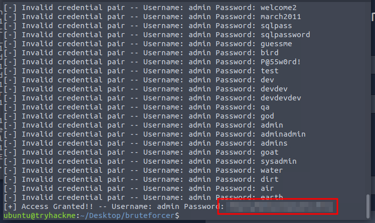
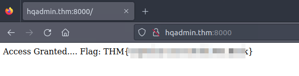

# Can't CAPTCHA this Machine!

## Solution
- Hit "Start Machine" and open the Split Screen View.
- What key process of training a neural network is taken care of by using a CNN?
<br/>
It is written in the description.
- What is the name of the process used in the CNN to extract the features?
<br/>
It is written in the description.
- What is the name of the process used to reduce the features down?
<br/>
It is written in the description.
- What off-the-shelf CNN did we use to train a CAPTCHA-cracking OCR model?
```bash
cd ~/Desktop/bruteforcer && python3 bruteforce.py
```



- What is the password that McGreedy set on the HQ Admin portal?
<br/>
Perform the login the get the flag.


