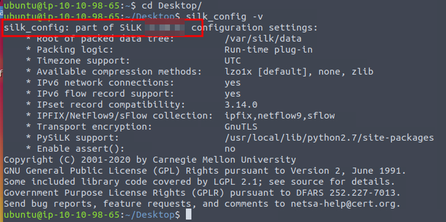

# I Tawt I Taw A C2 Tat!

## Solution
- Hit "Start Machine" and open the Split Screen View.
- Which version of SiLK is installed on the VM? 
```bash
silk_config -v
```



- What is the size of the flows in the count records?
```bash
rwfileinfo suspicious-flows.silk
```


- What is the start time (sTime) of the sixth record in the file?
```bash
rwcut suspicious-flows.silk --num-recs=6
```


- What is the destination port of the sixth UDP record?
```bash
rwfilter suspicious-flows.silk --proto=17 --pass=stdout | rwcut --num-recs=6 --fields=protocol,sPort,dPort
```


- What is the record value (%) of the dport 53?
```bash
rwstats suspicious-flows.silk --fields=dPort --values=records,packets,bytes,sIP-Distinct,dIP-Distinct --count=10
```


- What is the number of bytes transmitted by the top talker on the network?
```bash
rwstats suspicious-flows.silk --fields=sIP --values=bytes --count=10 --top
```


- What is the sTime value of the first DNS record going to port 53?
```bash
rwfilter FILENAME --saddress=175.175.173.221 --dport=53 --pass=stdout | rwcut --fields=sIP,dIP,stime | head -10
```


- What is the IP address of the host that the C2 potentially controls? (In defanged format: 123[.]456[.]789[.]0 )
<br/>
It can be inferred from the previous command.

- Which IP address is suspected to be the flood attacker? (In defanged format: 123[.]456[.]789[.]0 )
```bash
rwfilter suspicious-flows.silk --aport=80 --pass=stdout | rwstats --fields=sIP,dIP --count=10
```


- What is the sent SYN packet's number of records?
```bash
rwfilter FILENAME --saddress=175.215.236.223 --pass=stdout | rwstats --fields=sIP,flag,dIP --count=10
```


