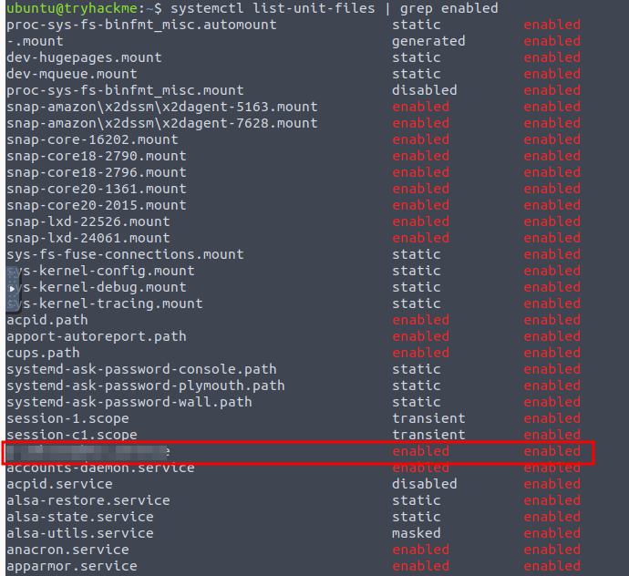
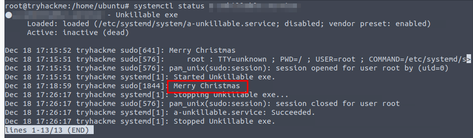

# A Gift That Keeps on Giving

## Solution
- Hit "Start Machine" and open the Split Screen View.
- What is the name of the service that respawns the process after killing it?
```bash
systemctl list-unit-files | grep enabled
```



- What is the path from where the process and service were running?
```bash
systemctl status <SERVICE_NAME>
```


- The malware prints a taunting message. When is the message shown? 
```bash
systemctl stop <SERVICE_NAME>
systemctl status <SERVICE_NAME>
```


