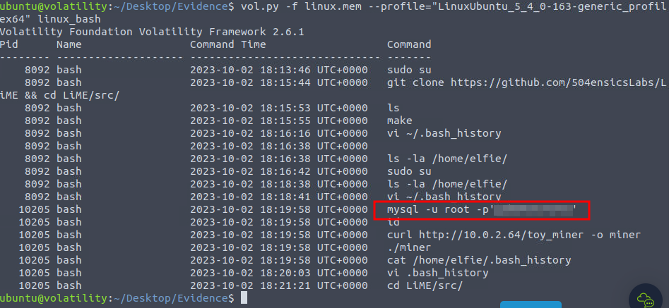
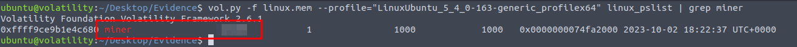
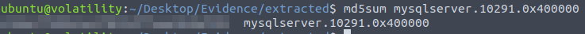
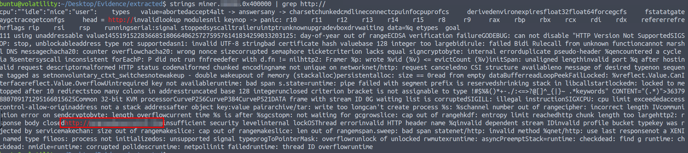
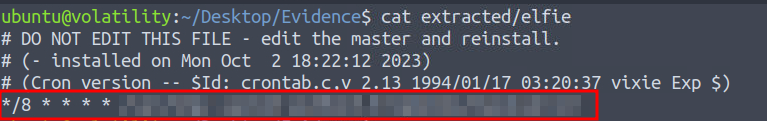

# CrypTOYminers Sing Volala-lala-latility                          

## Solution
- Hit "Start Machine" and open the Split Screen View or connect through RDP.
- What is the exposed password that we find from the bash history output?
```bash
vol.py -f linux.mem --profile="LinuxUbuntu_5_4_0-163-generic_profilex64" linux_bash
```



- What is the PID of the miner process that we find?
```bash
vol.py -f linux.mem --profile="LinuxUbuntu_5_4_0-163-generic_profilex64" linux_pslist | grep miner
```



- What is the MD5 hash of the miner process?
```bash
vol.py -f linux.mem --profile="LinuxUbuntu_5_4_0-163-generic_profilex64" linux_procdump -D extracted -p <PID>
md5sum miner.<PID>.0x400000
```


- What is the MD5 hash of the mysqlserver process?
```bash
vol.py -f linux.mem --profile="LinuxUbuntu_5_4_0-163-generic_profilex64" linux_procdump -D extracted -p <PID>
md5sum mysqlserver.<PID>.0x400000 
```



- Use the command
```bash
strings extracted/miner.10280.0x400000 | grep http://
```
What is the suspicious URL? (Fully defang the URL using CyberChef)



- After reading the elfie file, what location is the mysqlserver process dropped in on the file system?
```bash
vol.py -f linux.mem --profile="LinuxUbuntu_5_4_0-163-generic_profilex64" linux_enumerate_files | grep -i cron
vol.py -f linux.mem --profile="LinuxUbuntu_5_4_0-163-generic_profilex64" linux_find_file -i 0xffff9ce9b78280e8 -O extracted/elfie
cat extracted/elfie
```


