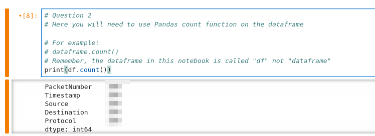
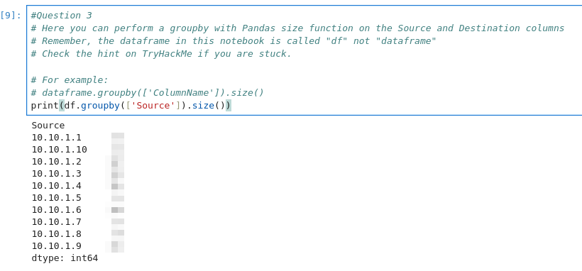
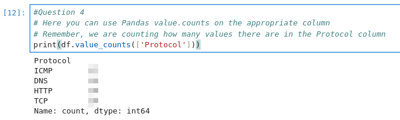

# O Data, All Ye Faithful

## Solution
- Hit "Start Machine" and connect at http://IP:8888 where the password is "tryhackme".
- How many packets were captured (looking at the PacketNumber)?
```python
print(df.count())
```



- What IP address sent the most amount of traffic during the packet capture?
```python
print(df.groupby(['Source']).size())
```



- What was the most frequent protocol?
```python
print(df.value_counts(['Protocol']))
```


