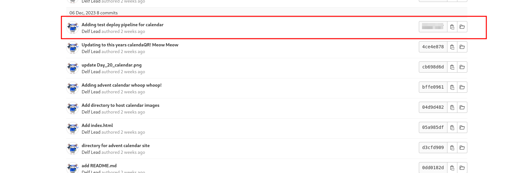

# Advent of Frostlings                         

## Solution
- Hit "Start Machine" and browse http://IP.
- What is the handle of the developer responsible for the merge changes?
 
Open the merged request and read the comments.

- What port is the defaced calendar site server running on?
 
Open the CI/CD editor to review the script and find the port.

- What server is the malicious server running on?
 
Open the CI/CD editor to review the script and find the server.

- What message did the Frostlings leave on the defaced site?
 
Browse http://IP:9081 to find the defaced message.

- What is the commit ID of the original code for the Advent Calendar site?
 
Check the commit history to find when the ".gitlab-ci.yml" file has been created.

