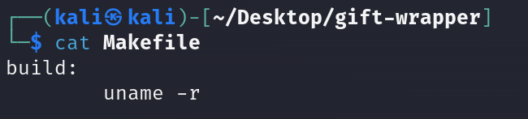
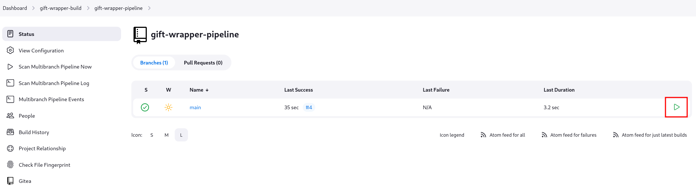
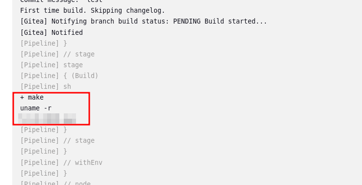
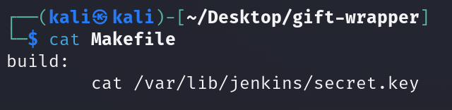
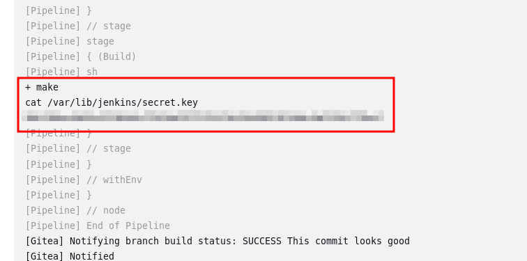

# Yule be Poisoned: A Pipeline of Insecure Code!                         

## Solution
- Hit "Start Machine".
- What Linux kernel version is the Jenkins node?
<br/>
Browse http://IP:3000 and login with the credentials guest:password123.
Clone the "gift-wrapper-pipeline" repository.
```bash
git clone http://IP:3000/McHoneyBell/gift-wrapper.git
```
Change the "Makefile" to run the command "uname -r".



Commit and push the new changes.
```bash
git add .
git commit -m "test"
git push
```
Login in the Jenkins portal at http://IP:8080 to schedule a build and retrieve the output.





- What value is found from /var/lib/jenkins/secret.key?
Change the "Makefile" to run the command "cat /var/lib/jenkins/secret.key".



Commit and push the new changes.
```bash
git add .
git commit -m "test"
git push
```
Login in the Jenkins portal at http://IP:8080 to schedule a build and retrieve the output.



