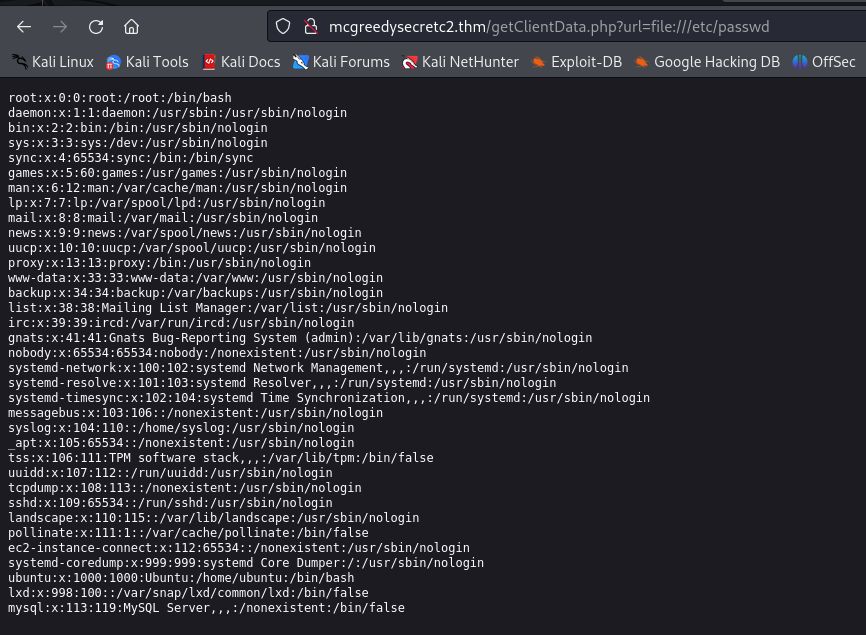
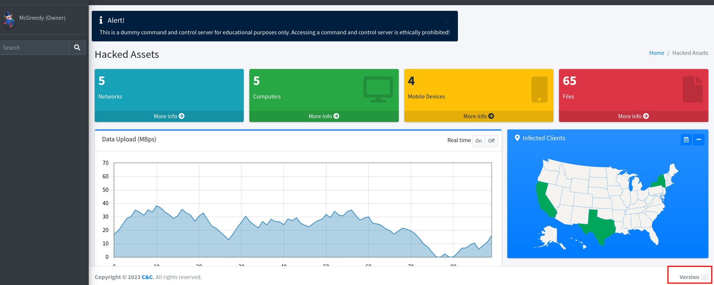
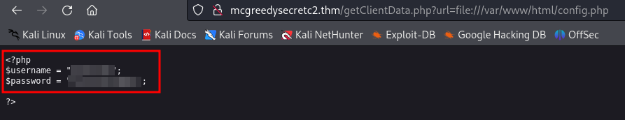
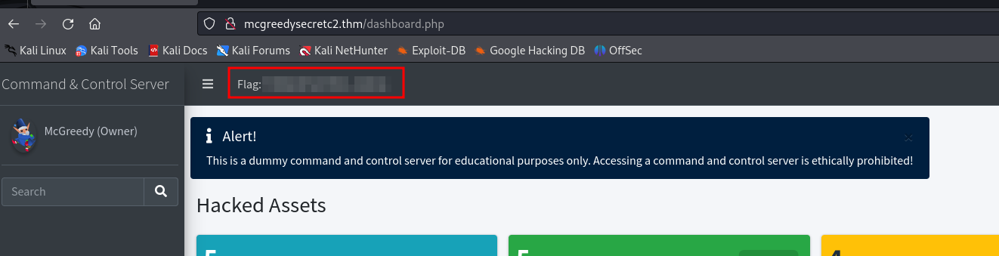
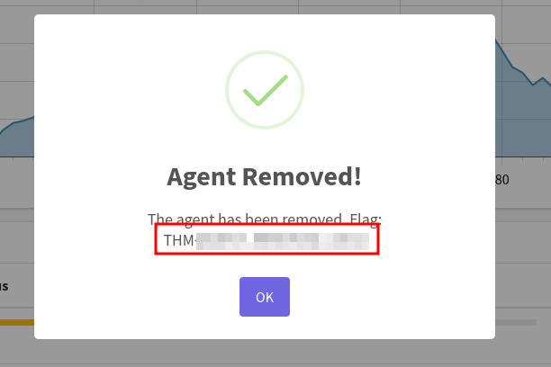

# Jingle Your SSRF Bells: A Merry Command & Control Hackventure                                               

## Solution
- Hit "Start Machine".
- Is SSRF the process in which the attacker tricks the server into loading only external resources (yea/nay)?
 
It is written in the description.
- What is the C2 version?
 
Browse the page http://mcgreedysecretc2.thm/api.php to see the API. An API is http://mcgreedysecretc2.thm/getClientData.php?url= where the "url" parameter is vulnerable to SSRF. For example, the file passwd can be accessed requesting it with http://mcgreedysecretc2.thm/getClientData.php?url=file:///etc/passwd.

Try to access the "config.php" with http://mcgreedysecretc2.thm/getClientData.php?url=file:///var/www/html/config.php file to find the credentials and log in.
After logging in, the version can be obtained from the dashboard.

- What is the username for accessing the C2 panel?
The username can be found accessing the config file with http://mcgreedysecretc2.thm/getClientData.php?url=file:///var/www/html/config.php.

- What is the flag value after accessing the C2 panel?
The flag can be found in the dashboard after logging in.

- What is the flag value after stopping the data exfiltration from the McSkidy computer?
Remove the agent from McSkidy computer to get the flag.

