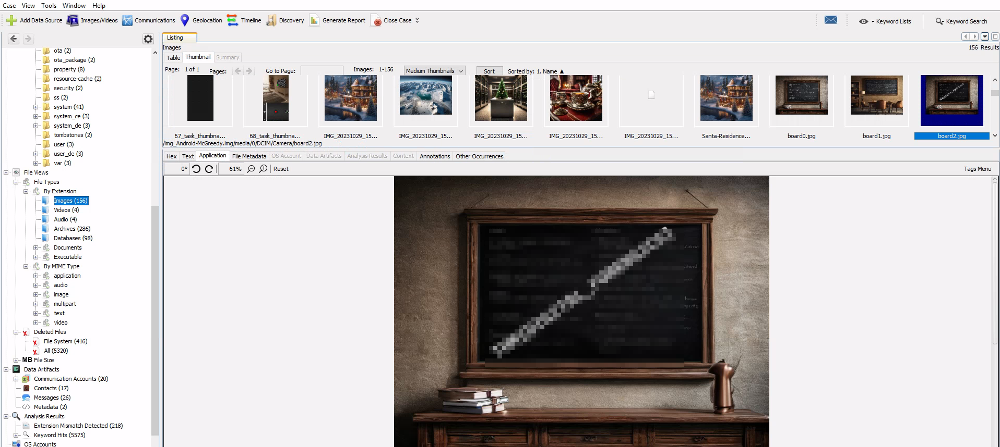
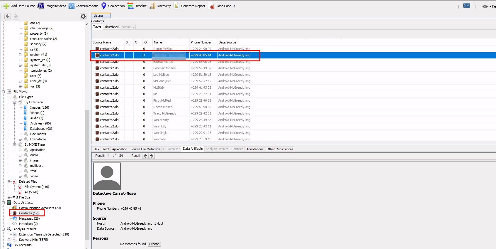
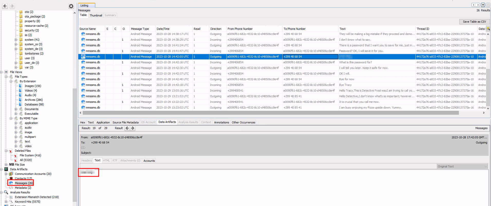

# You Are on the Naughty List, McGreedy

## Solution
- Hit "Start Machine" and open the Split Screen View or connect through RDP.
- One of the photos contains a flag. What is it?
 
Go to File Views -> File Types -> By Extensions -> Images. Then switch to Thumbnails menu to look for the flag.

- What name does Tracy use to save Detective Frost-eau’s phone number?
 
Go under Contacts.

- One SMS exchanged with Van Sprinkles contains a password. What is it?
 
Go under Messages.

