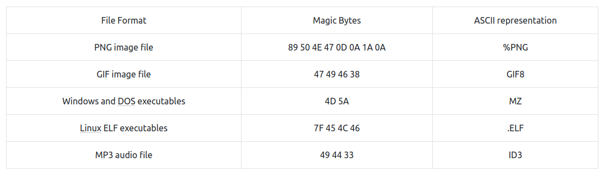
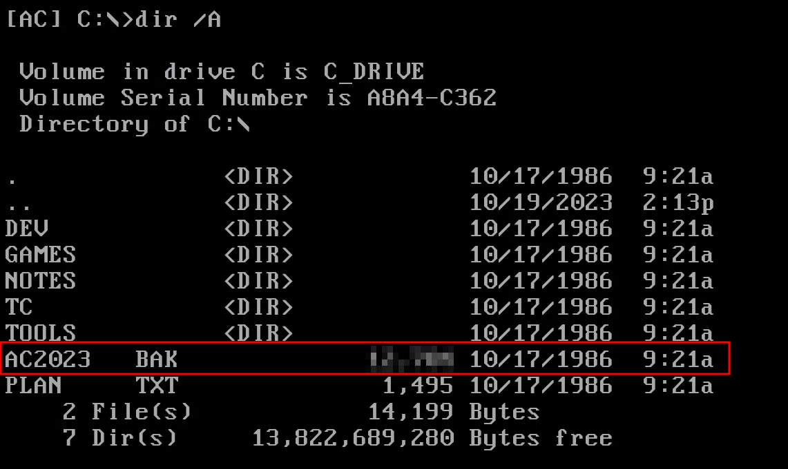
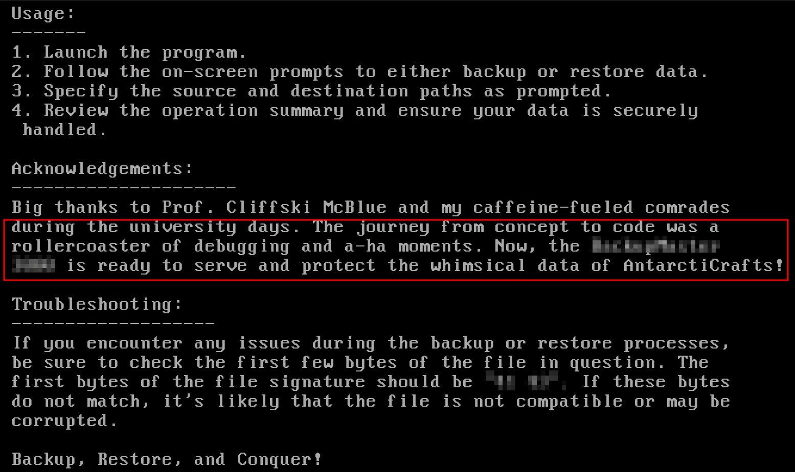
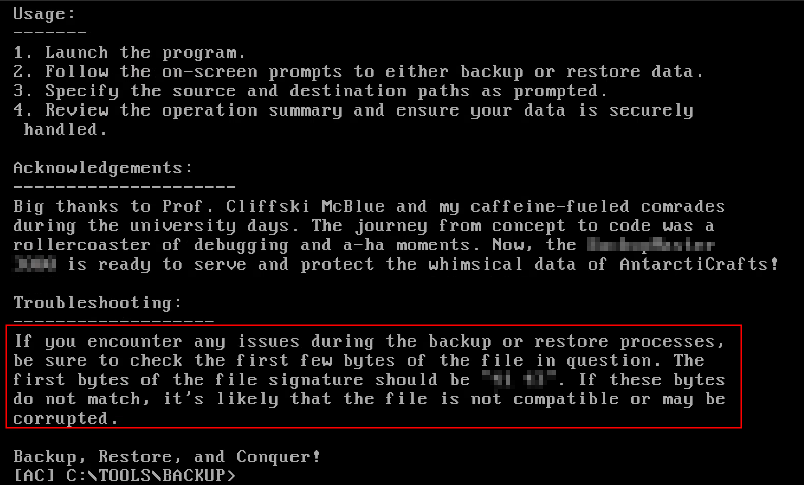
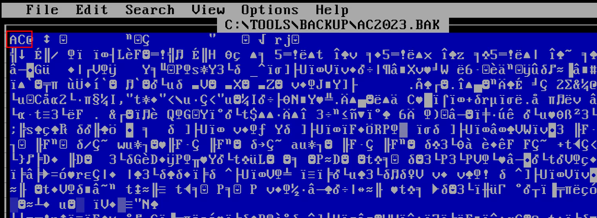
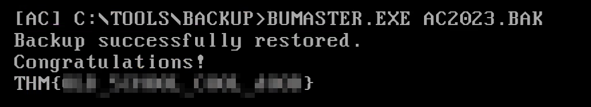

#  A Christmas DOScovery: Tapes of Yule-tide Past

## Notes
Magic Bytes table.



## Solution
- Hit "Start Machine" and RDP connect to the given IP.
```bash
xfreerdp /u:Administrator /p:Passw0rd! /v:10.10.245.210 /f
```
- How large (in bytes) is the AC2023.BAK file?
```bash
dir /A
```



- What is the name of the backup program?
```bash
cd TOOLS\BACKUP
type readme.txt
```



- What should the correct bytes be in the backup's file signature to restore the backup properly?
```bash
type readme.txt
```



- What is the flag after restoring the backup successfully?
<br/>
Change XX to AC which in Hexadecimal is 41 43. Save and close with Alt+F.

```bash
edit AC2023.BAK
```



Then run the backup program to get the flag.

```bash
bumaster.exe AC2023.BAK
```


