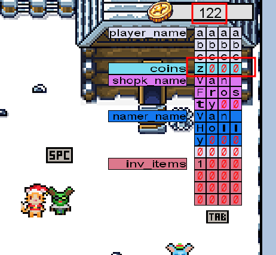
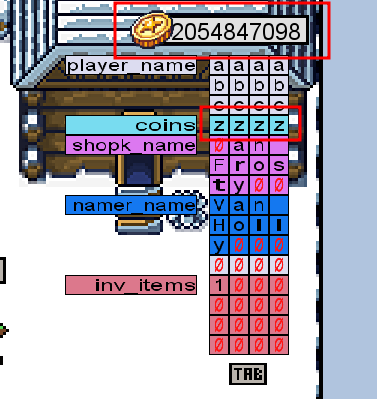
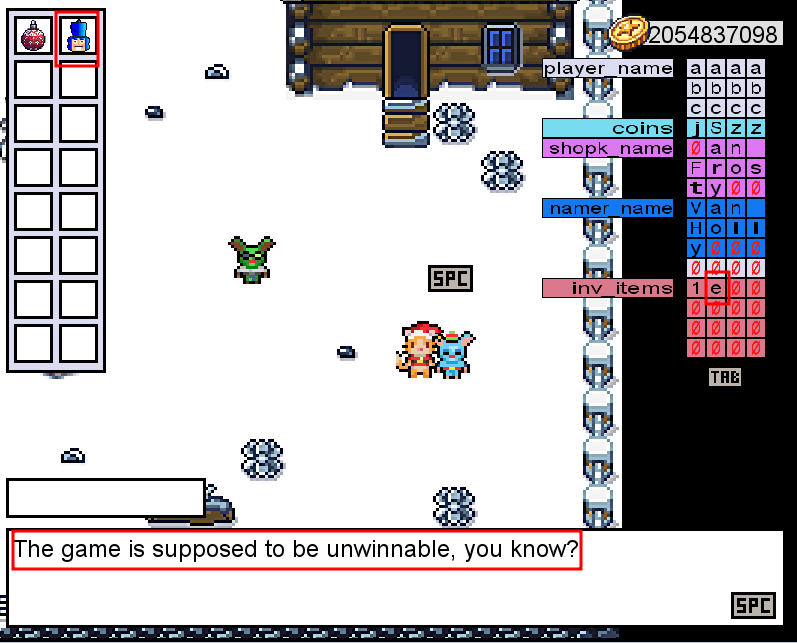
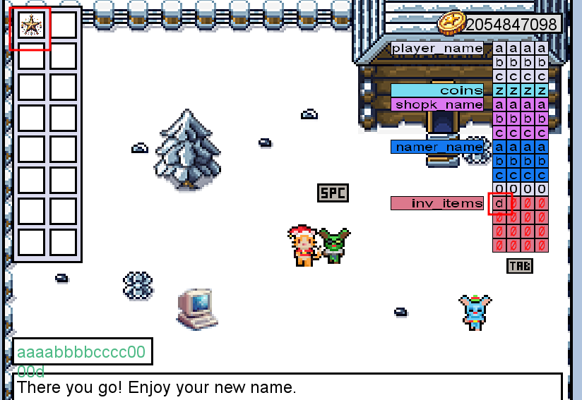
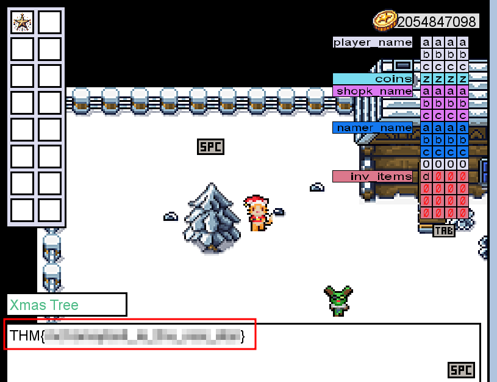

#  Memories of Christmas Past

## Solution
- Hit "Start Machine" and browse the given link to start the game https://IP.p.thmlabs.com./ .
- If the coins variable had the in-memory value in the image below, how many coins would you have in the game?
 
The "Coins" registry contains the value "4f 4f 50 53". Remebering the Little Endian architecture, the hexadecimal value is 53504f4f which converted to integer is 1397772111.

- What is the value of the final flag?
 
Firstly, mine 13 coins from the PC and change name using the string aaaabbbccccz.

More characters can be input with 120 coins. 10000 coins are needed to buy a star. So, change name with the string aaaabbbcccczzzz.

So, a start can be bought, but it does not really work.

Try to overwrite the memory until the inventory. The star corresponds to the character "d". Input aaaabbbcccczzzzaaaabbbccccaaaabbbcccc0000d.

A start appears in the inventory. Bring the star to the tree to get the flag.

