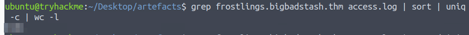

# 'Tis the season for log chopping!

## Solution
- Hit "Start Machine" and open the Split Screen View.
- How many unique IP addresses are connected to the proxy server?
```bash
cut -d ' ' -f2 access.log | sort | uniq | wc -l
```


- How many unique domains were accessed by all workstations?
```bash
cut -d ' ' -f3 access.log | cut -d ':' -f1 | sort | uniq -c | wc -l
```


- What status code is generated by the HTTP requests to the least accessed domain?
```bash
cut -d ' ' -f3 access.log | cut -d ':' -f1 | sort | uniq -c | sort -nr | tail -n 1
grep partnerservices.getmicrosoftkey.com access.log | cut -d ' ' -f6 | head -n 1 
```


- Based on the high count of connection attempts, what is the name of the suspicious domain?
```bash
cut -d ' ' -f3 access.log | cut -d ':' -f1 | sort | uniq -c | sort -n | tail -n 10
```


- What is the source IP of the workstation that accessed the malicious domain?
```bash
grep <DOMAIN> access.log | cut -d ' ' -f2 | head -n 1
```


- How many requests were made on the malicious domain in total?
```bash
grep <DOMAIN> | sort | uniq -c | wc -l
```



- Having retrieved the exfiltrated data, what is the hidden flag?
```bash
grep <DOMAIN> | cut -d ' ' -f5 | cut -d '=' -f2 | base64 -d | grep THM
```


