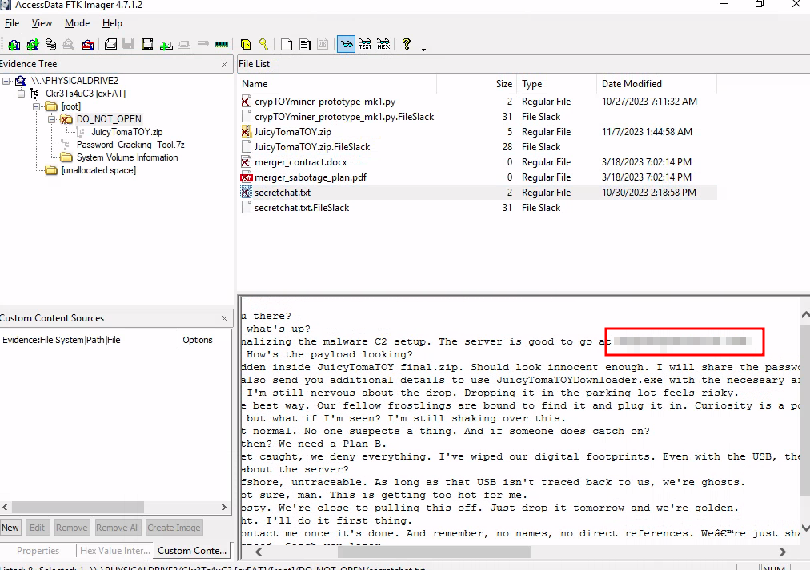
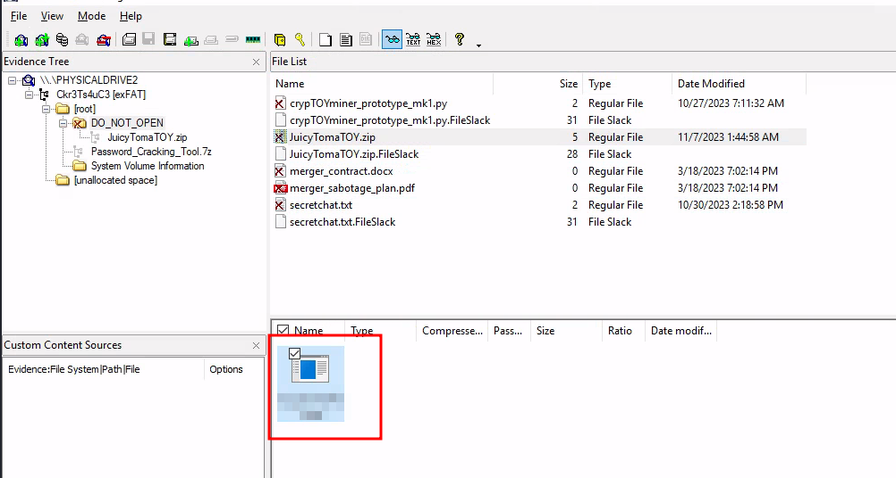
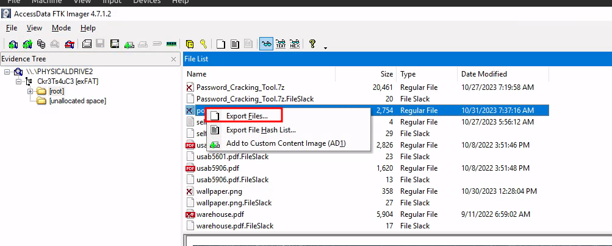
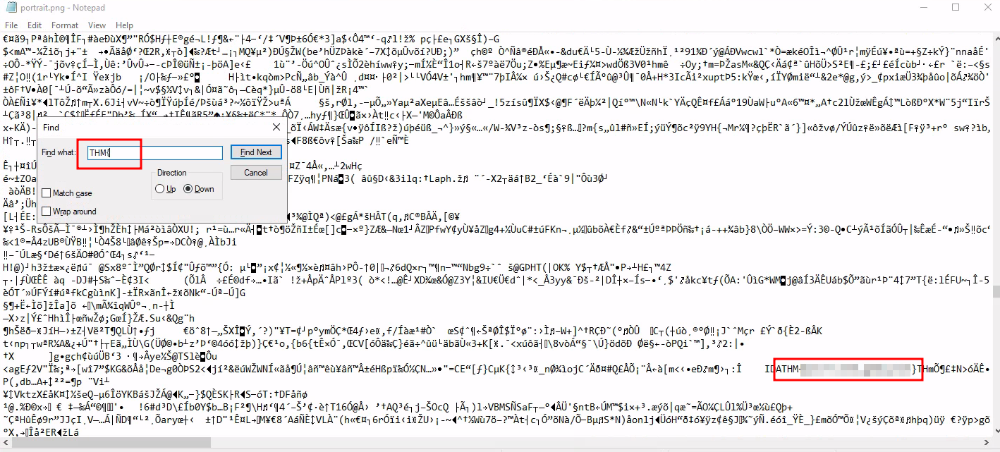
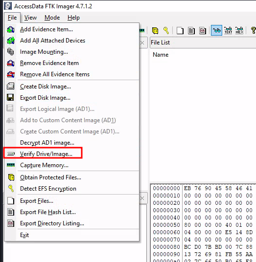
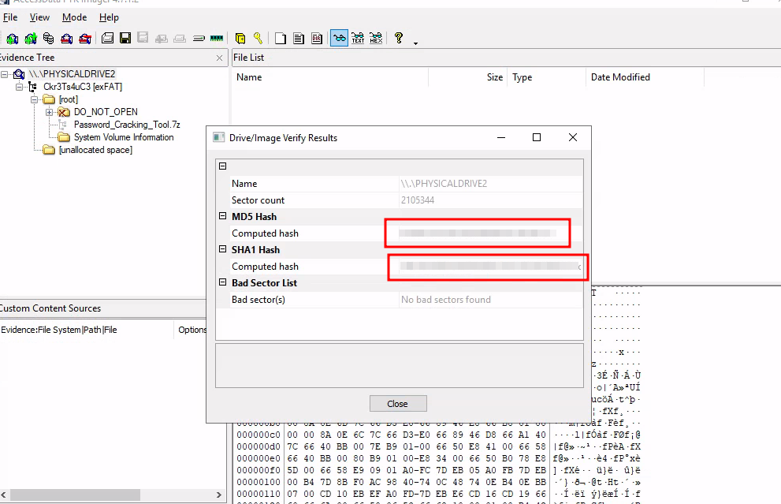

# Have a Jolly, Jolly Byte!

## Solution
- Hit "Start Machine" and open the Split Screen View or connect through RDP.
- What is the malware C2 server?

- What is the file inside the deleted zip archive?

- What flag is hidden in one of the deleted PNG files?

- What is the SHA1 hash of the physical drive and forensic image?

