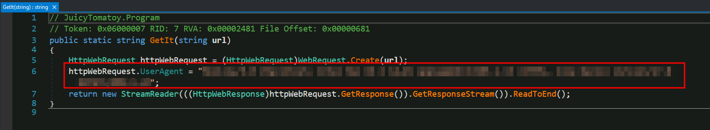
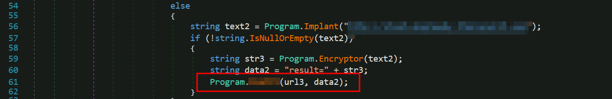
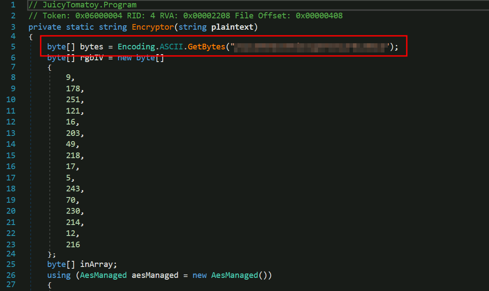
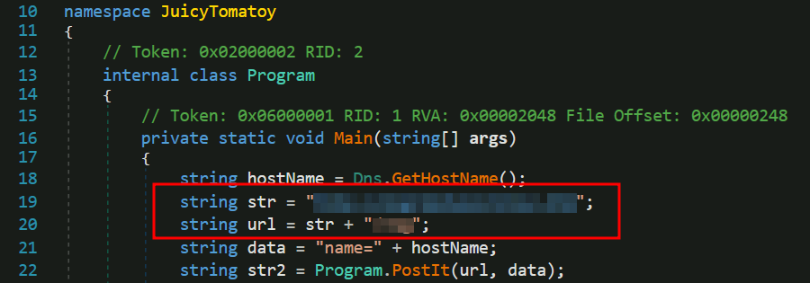
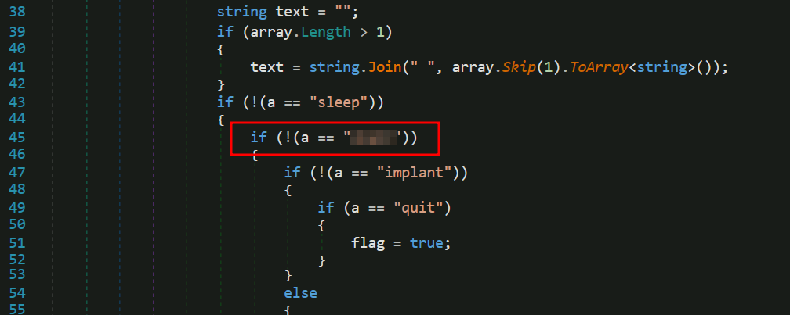
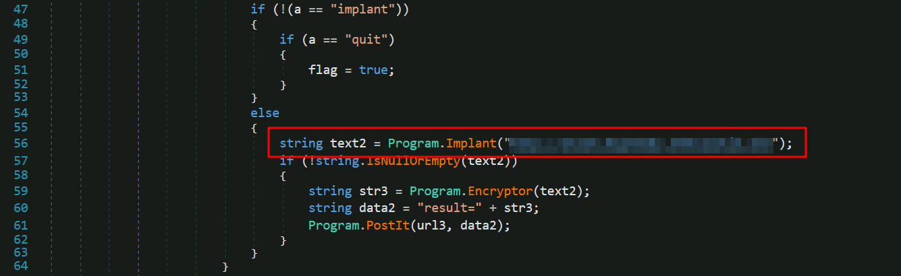

# She sells C# shells by the C2shore

## Solution
- Hit "Start Machine" and open the Split Screen View or connect through RDP.
- What HTTP User-Agent was used by the malware for its connection requests to the C2 server?

- What is the HTTP method used to submit the command execution output?

- What key is used by the malware to encrypt or decrypt the C2 data?

- What is the first HTTP URL used by the malware?

- How many seconds is the hardcoded value used by the sleep function?

- What is the C2 command the attacker uses to execute commands via cmd.exe?

- What is the domain used by the malware to download another binary?

